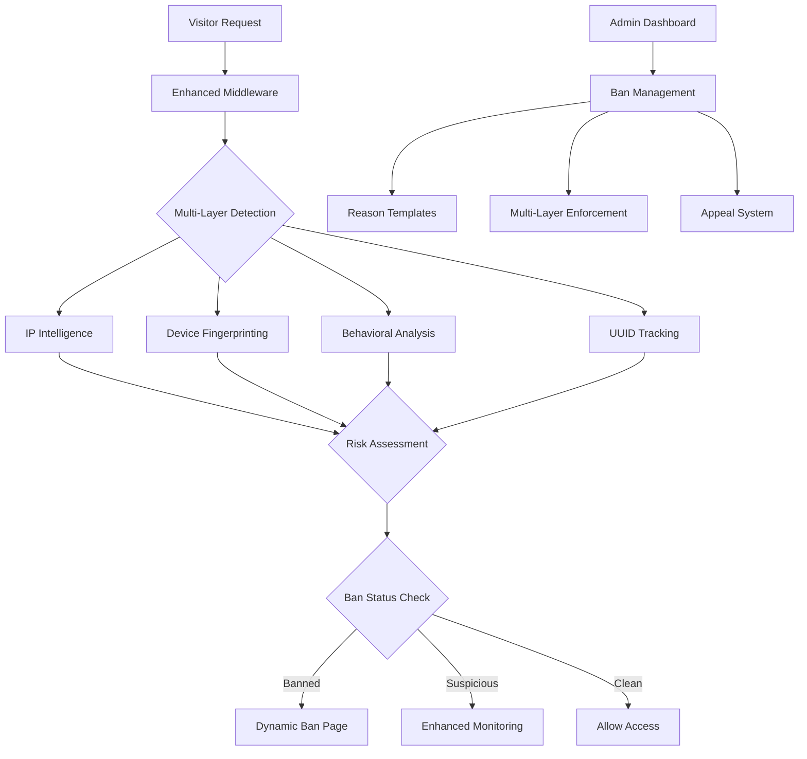

# Enhanced Multi-Layer Ban System Documentation

## Overview

This document describes the implementation of an advanced, incognito-proof ban system that uses multiple detection layers to prevent ban evasion and provides comprehensive admin controls with structured ban reasons.

## Table of Contents

1. [System Architecture](#system-architecture)
2. [Core Components](#core-components)
3. [Detection Layers](#detection-layers)
4. [Ban Enforcement](#ban-enforcement)
5. [Admin Interface](#admin-interface)
6. [API Endpoints](#api-endpoints)
7. [Security Features](#security-features)
8. [Implementation Guide](#implementation-guide)
9. [Testing Strategy](#testing-strategy)
10. [Troubleshooting](#troubleshooting)

## System Architecture

### High-Level Architecture



### Key Principles

1. **Server-Side Enforcement**: All ban checks happen server-side to prevent client-side bypass
2. **Multi-Layer Detection**: Multiple independent detection methods for redundancy
3. **Behavioral Analysis**: Real-time behavior monitoring to detect automated/suspicious activity
4. **Structured Reasons**: Predefined ban reason templates with severity levels
5. **Appeal Workflow**: Comprehensive appeal system with admin review process

## Core Components

### 1. Enhanced Middleware (`middleware.ts`)

The middleware intercepts all requests and performs server-side ban checking:

```typescript
// Key features:
- Server-side ban status verification
- Multi-layer detection integration
- Automatic redirection to ban page
- Risk score calculation
- Bypass prevention
```

**File**: [`middleware.ts`](../middleware.ts)

### 2. Ban Enforcement Engine (`lib/banEnforcement.ts`)

Core logic for ban detection and enforcement:

```typescript
// Key features:
- Enhanced device fingerprinting
- IP intelligence analysis
- Multi-layer ban record matching
- Risk score calculation
- Ban statistics and analytics
```

**File**: [`lib/banEnforcement.ts`](../lib/banEnforcement.ts)

### 3. Enhanced Visitor Tracking (`utils/enhancedVisitorTracking.ts`)

Advanced visitor identification and behavioral analysis:

```typescript
// Key features:
- Canvas fingerprinting
- WebGL fingerprinting
- Audio fingerprinting
- Font detection
- Mouse movement analysis
- Keyboard pattern analysis
- Behavioral risk scoring
```

**File**: [`utils/enhancedVisitorTracking.ts`](../utils/enhancedVisitorTracking.ts)

### 4. Admin Ban Management (`components/EnhancedBanManagement.tsx`)

Enhanced admin interface for ban management:

```typescript
// Key features:
- Dropdown ban reason selection
- Custom reason input
- Multi-layer enforcement options
- Bulk ban operations
- Ban duration settings
```

**File**: [`components/EnhancedBanManagement.tsx`](../components/EnhancedBanManagement.tsx)

### 5. Dynamic Ban Page (`app/ban/page.tsx`)

Enhanced ban page with detailed information:

```typescript
// Key features:
- Dynamic ban reason display
- Severity indicators
- Detection method information
- Appeal form integration
- Expiration countdown
```

**File**: [`app/ban/page.tsx`](../app/ban/page.tsx)

## Detection Layers

### Layer 1: IP Intelligence

**Purpose**: Identify visitors by IP address and analyze IP characteristics

**Implementation**:
- IP address hashing for privacy
- Geolocation analysis
- ISP and connection type detection
- VPN/Proxy detection (basic)
- IP reputation scoring

**Bypass Resistance**: Medium (can be bypassed with VPN/proxy)

### Layer 2: Enhanced Device Fingerprinting

**Purpose**: Create unique device signatures that persist across sessions

**Techniques**:
- Canvas fingerprinting
- WebGL renderer fingerprinting
- Audio context fingerprinting
- Font detection fingerprinting
- Hardware characteristics
- Browser feature detection

**Bypass Resistance**: High (very difficult to spoof all characteristics)

### Layer 3: Behavioral Analysis

**Purpose**: Detect automated behavior and suspicious patterns

**Metrics**:
- Mouse movement patterns
- Click timing and patterns
- Scroll behavior analysis
- Keyboard typing patterns
- Navigation flow analysis
- Focus/blur event patterns

**Bypass Resistance**: Very High (nearly impossible to perfectly mimic human behavior)

### Layer 4: UUID Tracking

**Purpose**: Traditional visitor identification with enhanced persistence

**Storage Methods**:
- localStorage
- sessionStorage
- HTTP cookies
- IndexedDB
- Multiple fallback mechanisms

**Bypass Resistance**: Low (easily bypassed in incognito mode)

## Ban Enforcement

### Ban Types

1. **Temporary Ban**
   - Has expiration date/time
   - Automatically lifts when expired
   - Default durations based on severity
   - Appealable by default

2. **Permanent Ban**
   - No expiration
   - Requires manual admin intervention to lift
   - Used for serious violations
   - May or may not be appealable

3. **Escalated Ban**
   - Result of repeated violations
   - Longer duration or permanent
   - Higher severity classification
   - Limited appeal options

### Severity Levels

1. **Low** (Yellow)
   - Minor violations
   - Short duration (hours to days)
   - Always appealable
   - Auto-escalation enabled

2. **Medium** (Orange)
   - Moderate violations
   - Medium duration (days to weeks)
   - Usually appealable
   - May have auto-escalation

3. **High** (Red)
   - Serious violations
   - Long duration (weeks to months)
   - Appealable with review
   - No auto-escalation

4. **Critical** (Dark Red)
   - Severe violations
   - Permanent or very long duration
   - May not be appealable
   - Immediate enforcement

### Enforcement Methods

Admins can choose which detection layers to enforce:

- **IP Enforcement**: Ban applies to IP address
- **Fingerprint Enforcement**: Ban applies to device fingerprint
- **Behavioral Enforcement**: Ban applies to behavior patterns
- **Geolocation Enforcement**: Ban applies to geographic region

## Admin Interface

### Ban Reason Templates

Predefined templates with structured information:

```typescript
interface BanReasonTemplate {
  category: string;           // "Spam", "Abuse", "Security", etc.
  subcategory?: string;       // "Content Spam", "Bot Activity", etc.
  defaultText: string;        // Default reason text
  severity: 'low' | 'medium' | 'high' | 'critical';
  requiresCustomText: boolean; // Force admin to provide details
  autoEscalation: boolean;    // Enable automatic escalation
  appealable: boolean;        // Allow appeals
  defaultDuration?: number;   // Default ban duration in ms
}
```

### Enhanced Ban Management Features

1. **Dropdown Reason Selection**
   - Categorized ban reasons
   - Severity-based organization
   - Template-based consistency

2. **Custom Reason Input**
   - Required for certain violation types
   - Free-form text for specific details
   - Validation and length requirements

3. **Multi-Layer Enforcement**
   - Checkbox selection for enforcement methods
   - Visual indicators for each layer
   - Recommended combinations

4. **Bulk Operations**
   - Select multiple visitors
   - Apply same ban reason and settings
   - Batch processing with progress tracking

5. **Ban Analytics**
   - Effectiveness metrics
   - Evasion attempt detection
   - Appeal success rates
   - Risk distribution analysis

## API Endpoints

### Ban Enforcement API

#### `POST /api/ban/enforce`
Enforce a new ban with multi-layer detection

**Request Body**:
```json
{
  "uuid": "visitor-uuid",
  "banType": "temporary|permanent|escalated",
  "reason": {
    "category": "Spam",
    "customReason": "Posting promotional content",
    "severity": "low"
  },
  "enforcement": {
    "byIP": true,
    "byFingerprint": true,
    "byBehavior": false,
    "byGeolocation": false
  },
  "adminId": "admin-user-id",
  "expiresAt": "2024-01-01T00:00:00Z"
}
```

#### `GET /api/ban/enforce?adminId=xxx`
Get ban enforcement statistics

### Ban Reasons API

#### `GET /api/ban/reasons`
Get all available ban reason templates

**Query Parameters**:
- `category`: Filter by category
- `severity`: Filter by severity level
- `appealable`: Filter by appealable status

#### `POST /api/ban/reasons`
Create new ban reason template (admin only)

#### `PUT /api/ban/reasons`
Update existing ban reason template (admin only)

### Visitor Status API

#### `GET /api/visitors/status?uuid=xxx`
Check visitor ban status (enhanced)

**Response**:
```json
{
  "status": "banned|active|suspicious",
  "banRecord": {
    "reason": "Spam - Bot Activity",
    "severity": "medium",
    "type": "temporary",
    "expiresAt": "2024-01-01T00:00:00Z",
    "appealable": true,
    "matchedBy": ["ip", "fingerprint"],
    "confidence": 85
  },
  "riskScore": 75
}
```

## Security Features

### Anti-Evasion Measures

1. **Fingerprint Evolution Tracking**
   - Monitor changes in device fingerprints
   - Detect attempts to modify characteristics
   - Flag suspicious fingerprint variations

2. **IP Range Monitoring**
   - Track bans across IP ranges
   - Detect VPN/proxy switching patterns
   - Geographic consistency analysis

3. **Behavioral Consistency**
   - Compare behavior patterns over time
   - Detect sudden behavioral changes
   - Flag inconsistent interaction patterns

4. **Cross-Reference Validation**
   - Validate identity across multiple layers
   - Detect conflicting identification data
   - Flag impossible combinations

### Privacy Compliance

1. **Data Hashing**
   - Hash sensitive identifiers (IP addresses)
   - Irreversible transformation for privacy
   - Maintain functionality without exposure

2. **Retention Policies**
   - Automatic data cleanup after retention period
   - Configurable retention durations
   - GDPR-compliant data handling

3. **Consent Management**
   - Respect user privacy preferences
   - Honor Do Not Track headers
   - Provide opt-out mechanisms

4. **Audit Logging**
   - Complete audit trail for compliance
   - Admin action logging
   - Data access tracking

## Implementation Guide

### Step 1: Deploy Core Components

1. Deploy enhanced middleware
2. Set up ban enforcement engine
3. Configure database collections
4. Initialize ban reason templates

### Step 2: Integrate Admin Interface

1. Add enhanced ban management component
2. Update admin dashboard
3. Configure admin authentication
4. Test ban enforcement workflow

### Step 3: Enable Advanced Features

1. Deploy enhanced visitor tracking
2. Enable behavioral analysis
3. Configure risk scoring
4. Set up real-time monitoring

### Step 4: Configure Security

1. Set up IP intelligence
2. Configure fingerprinting
3. Enable evasion detection
4. Implement privacy controls

### Database Schema

#### Bans Collection
```typescript
interface BanRecord {
  id: string;
  targetIdentifiers: {
    uuid?: string;
    ipHash: string;
    fingerprintHash: string;
    behaviorHash?: string;
  };
  banType: 'temporary' | 'permanent' | 'escalated';
  reason: {
    category: string;
    customReason?: string;
    severity: 'low' | 'medium' | 'high' | 'critical';
  };
  enforcement: {
    byIP: boolean;
    byFingerprint: boolean;
    byBehavior: boolean;
    byGeolocation: boolean;
  };
  metadata: {
    adminId: string;
    timestamp: string;
    expiresAt?: string;
    appealStatus?: 'none' | 'pending' | 'approved' | 'rejected';
  };
  isActive: boolean;
}
```

#### Ban Reason Templates Collection
```typescript
interface BanReasonTemplate {
  id: string;
  category: string;
  subcategory?: string;
  defaultText: string;
  severity: 'low' | 'medium' | 'high' | 'critical';
  requiresCustomText: boolean;
  autoEscalation: boolean;
  appealable: boolean;
  defaultDuration?: number;
  isActive: boolean;
  createdAt: string;
  updatedAt: string;
}
```

#### Ban Checks Collection (Analytics)
```typescript
interface BanCheckLog {
  timestamp: string;
  ipHash: string;
  fingerprintHash: string;
  uuid: string | null;
  isBanned: boolean;
  matchedBy: string[];
  confidence: number;
  riskScore: number;
  userAgent: string;
  path: string;
  error?: string;
}
```

## Testing Strategy

### Unit Tests

1. **Ban Enforcement Logic**
   - Test multi-layer detection
   - Verify risk score calculation
   - Test ban record creation

2. **Fingerprinting Functions**
   - Test fingerprint generation
   - Verify hash consistency
   - Test error handling

3. **Behavioral Analysis**
   - Test pattern detection
   - Verify risk scoring
   - Test bot detection

### Integration Tests

1. **Middleware Integration**
   - Test request interception
   - Verify ban redirection
   - Test error handling

2. **API Endpoint Testing**
   - Test ban enforcement API
   - Verify reason template API
   - Test visitor status API

3. **Database Integration**
   - Test ban record CRUD operations
   - Verify query performance
   - Test data consistency

### End-to-End Tests

1. **Ban Enforcement Flow**
   - Admin bans visitor
   - Visitor gets redirected
   - Appeal submission works

2. **Evasion Prevention**
   - Test incognito mode bypass prevention
   - Verify VPN detection
   - Test fingerprint persistence

3. **Admin Workflow**
   - Test ban management interface
   - Verify bulk operations
   - Test appeal review process

## Troubleshooting

### Common Issues

#### 1. Middleware Not Triggering
**Symptoms**: Bans not being enforced, visitors accessing site when banned
**Solutions**:
- Check middleware configuration in `next.config.js`
- Verify middleware matcher patterns
- Check Firebase Admin SDK initialization

#### 2. Fingerprinting Failures
**Symptoms**: High error rates in fingerprint generation
**Solutions**:
- Check browser compatibility
- Verify canvas/WebGL support
- Add fallback fingerprinting methods

#### 3. False Positives
**Symptoms**: Legitimate users getting banned
**Solutions**:
- Adjust risk score thresholds
- Review behavioral analysis parameters
- Check IP intelligence accuracy

#### 4. Performance Issues
**Symptoms**: Slow page loads, high server response times
**Solutions**:
- Optimize database queries
- Implement caching for ban checks
- Reduce fingerprinting complexity

### Debug Mode

Enable debug logging by setting environment variable:
```bash
DEBUG_BAN_SYSTEM=true
```

This will provide detailed logging for:
- Ban check processes
- Fingerprint generation
- Risk score calculation
- Database operations

### Monitoring

Key metrics to monitor:
- Ban enforcement success rate
- False positive rate
- Evasion attempt detection
- System performance impact
- Appeal resolution time

## Conclusion

This enhanced multi-layer ban system provides robust protection against ban evasion while maintaining user privacy and providing comprehensive admin controls. The system's multiple detection layers ensure that even sophisticated evasion attempts are detected and prevented.

The structured approach to ban reasons and the comprehensive appeal system ensure fair and transparent moderation while providing administrators with the tools they need to effectively manage their platform.

Regular monitoring and adjustment of the system parameters will ensure optimal performance and minimal false positives while maintaining strong security against malicious actors.